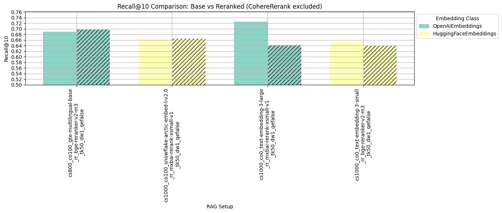

# **RAG Setups Evaluation Report**  
**Author**: Alisa Malakhova

## Overview

This report documents a **multi-phase evaluation** of Retrieval-Augmented Generation (RAG) configurations tailored for **codebase retrieval tasks**. The goal was not to identify a single “best” setup, but to explore **practical trade-offs** across:

- Latency vs. retrieval quality  
- Open-source vs. closed-source components  
- Reranker-based vs. reranker-free pipelines  
- The impact of query expansion  

Each phase targeted a different optimization axis, ultimately surfacing representative setups aligned with distinct deployment priorities.

⚠️ *Note:* Due to compute constraints, all open-source models tested ranged between **100M–500M parameters**. In contrast, closed-source systems (e.g., OpenAI, Cohere) use significantly larger models and consistently outperform smaller counterparts.

---

## Phase 1: Embedding and Chunking Search

The first phase focused on identifying **strong base pipelines** by experimenting with:

- **Chunk size and overlap**  
- **Dense weight scaling** for hybrid search  
- A wide range of **embedding models** (both open- and closed-source)

    

    

The best results where achieved by OpenAI Models.

    

    

Instead of selecting the top 4 models purely by recall, I chose the **top 4 configurations using distinct models** to ensure a mix of:

- **Closed-source** (e.g. OpenAI)
- **Open-source** (e.g. HuggingFace-based)
- **High-recall but high-latency**
- **Lightweight**

## Phase 2: Reranker Integration

For each of the models selected in Phase 1, I evaluated retrieval performance with rerankers. The rerankers tested included:

- **HuggingFace Cross-Encoders**  
  - `BAAI/bge-reranker-large`  
  - `BAAI/bge-reranker-v2-m3`  
  - `mixedbread-ai/mxbai-rerank-xsmall-v1`
- **Cohere Rerank API**  
  - `rerank-v3.5`

    

    

Surprisingly, combining OpenAI text_embedding_small model with a Cohere reranker gives better Recall than using text_embedding_large model. However, using Cohere API comes at a price of 2$ per 1000 requests.

    

    

The Cohere Reranker delivers the best results — but at a significant cost.

    

    

Recommended setups:
- Closed source:
   - **Best overall (but costly), Recall@10=0.74**: OpenAI small embedding + Cohere reranker  
   - **High performance, lower cost, Recall@10=0.72**: OpenAI large embedding (no reranker)  
- Open source:
   - **Top open-source, decent performance, Recall@10=0.67**: gte_multilingual_base + bge-reranker-v2-m3  
   - **Lightweight option, lowest latency, Recall@10=0.66**: gte_multilingual_base

<table border="1" class="dataframe">
  <thead>
    <tr style="text-align: right;">
      <th></th>
      <th>run_name</th>
      <th>recall@10</th>
      <th>avg_latency</th>
    </tr>
  </thead>
  <tbody>
    <tr>
      <th>0</th>
      <td>cs1000_co0_text-embedding-3-small_rr_rerank-v3...</td>
      <td>0.738725</td>
      <td>2.258022</td>
    </tr>
    <tr>
      <th>1</th>
      <td>cs1000_co100_text-embedding-3-large_tk50_dw1_q...</td>
      <td>0.724755</td>
      <td>0.657062</td>
    </tr>
    <tr>
      <th>2</th>
      <td>cs800_co100_gte-multilingual-base_rr_bge-reran...</td>
      <td>0.665196</td>
      <td>0.0301783</td>
    </tr>
    <tr>
      <th>3</th>
      <td>cs800_co100_gte-multilingual-base_tk50_dw1_qef...</td>
      <td>0.662255</td>
      <td>0.017295</td>
    </tr>
  </tbody>
</table>

---

## Phase 3: Query Expansion Analysis

In the final phase, I evaluated the impact of **query expansion** by modifying the query through an LLM prompt across the top 4 configurations.

    

    

Contrary to expectations, this approach led to lower Recall. This suggests that the current prompt or method may not be optimal. Further exploration of alternative prompts or query expansion techniques could yield better results.

---

## Summary

Each phase contributed to refining the RAG system:

1. **Optimal embeddings and chunking strategies** were identified first.
2. **Reranker effectiveness** was evaluated and applied where beneficial.
3. **Query expansion** was explored but did not improve Recall, indicating the need for better prompting or alternative techniques.

The result is a set of four well-optimized RAG configurations that prioritize both performance and efficiency, making them suitable for practical use in codebase QA systems.
